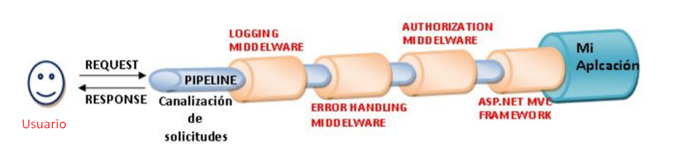

# Startup
* ConfigureServices: Se usa para configurar cualquier servicio personalizado (no default) en nuestra aplicación.
* Configure: Se usa para configurar todos los middleware utilizados en nuestra aplicación.

# Como es el manejo dentro de .NET Core?

1) La app se inicia dentro de Program.cs
2) Una vez completada la configuración inicial, se inicia Startup.cs . Podemos usar su constructor para inyectar algunos de los servicios internos y configurarlos, si es necesario.
3) Se accede a ConfigureServices, dentro de Startup, donde definimos los servicios que utilizará nuestra aplicación, incluído el propio MVC.
4) Se accede al método Configure, donde utilizamos IApplicationBuilder para configurar los middleware.
5) Completada la inicializacion de los middleware, nuestra app está lista para procesar solicitudes.
6) Cuando una solicitud llega a nuestro servidor, es el middleware el que se hace cargo y la maneja.

## Middleware
Es un componente (clase) que se ejecuta ante cada solocitud en la aplicación ASP.NET Core.
Normalmente, habrá varios middleware en la aplicación web ASP.NET Core. Puede ser middleware proporcionado por el Framework, agregado a través de NuGet, o su propio middleware personalizado.

Mediante el uso de middleware, puede inspeccionar la solicicitud y tomar decisiones importantes sobre cómo manejar la solicitud actual. En cualquier momento, si es necesario, puede salir del middleware pipeline y devolver una respuesta final.

El flujo de middlewares y su ordeb determinan cómo se ejecuta la apllicación.
Podemos establecer el orden de ejecución del middleware en el pipeline.



Cada bloque middleware hace algo con la solicitud y tiene una determinada función. Generalmente se necesitan muchos middleware para que nuestra app funcione según lo previsto.

## Solicitar Delegados

Podemos configurar el middleware usando los *delegates* **Use**, **Run** o el método de extensión **Map** de la instancia IApplicationBuilder.
Podemos declarar el middleware en linea usando un *delegate anonimo* en linea. También podemos definirlo como una clase reutilizable. 

Cuando se trata de una solicitud, utilizamos **IApplicationBuilder**.

Hay 4 métodos disponibles para interactuar con una solicitud:

### app.Run()
Este componente middleware se ejecuta al final del pipeline.
* finaliza la solicitud, y anula la ejecución de los middleware debajo de él en el código.
* no llama al próximo delegado (cortocircuito)
* para cuando un delegado no pasa la solicitud al siguiente delegado, se hace un *cortocircuito* en el *request pipeline*

### app.Use()
Se agrega al pipeline y puede pasar la solicitud al siguiente delegado (**next.Invoke**), o tambien puede finalizar la solicitud (ultimo pipeline).

### app.Map()
Map se usa para conectar una ruta de solicitud con otro middleware, el cual puede usar cualquier de los otros delegados de solicitud mencionados.

Ejemplo: Ejecuta el middleware si la ruta coincide con el valor del parámetro.

```
app.Map ("/Map" , (map) => 
{    
    map.Run (async (context) =>
    {
        await context.Response.WriteAsync("Run middleware " + "inside of map middleware");
    });
});

app.Run (async (context) => 
{
    await context.Response.WriteAsync("Inside run middleware");
});

```

### app.MapWhen()
Se comporta igual que Map, pero podemos especificar la condición detallada usando un objeto *HttpContext*.
Podríamos buscar URL, encabezados, cadenas de consulta, cookies, etc.

```

app.MapWhen( context => context.Request.Path.StartsWithSegments("/mapwhen"),
  (appBuilder) => {
      
      appBuilder.Run( async (context) => {
            
            await context.Response.WriteAsync("Hello world from MapWhen");
      });
 });

```

## Servicios

Son clases que exponen funcionalidades, luego pueden usarse en diferentes partes de la aplicación y usan *inyección de dependencia*.
El patrón de *inyección de dependencia* se usa mucho en la arquitectura ASP.NET Core. Incluye un **contenedor IoC integrado** para proporcionar objetos dependientes mediante constructores

---
La inversión de dependencias suele también conocerse como inversión de control. En inglés, los términos más frecuentemente utilizados son "dependency inversion", abreviado como "DI", e "inversion of control" o simplemente "IoC".

Muy resumidamente, el Principio de Inversión de Dependencias propone evitar las dependencias rígidas entre componentes mediante las siguientes técnicas:

* Utilizar abstracciones (interfaces) en lugar de referencias directas entre clases, lo que facilita que podamos reemplazar componentes con suma facilidad.
* Hacer que una clase reciba referencias a los componentes que necesite para funcionar, en lugar de permitir que sea ella misma quien los instancie de forma directa o a través de factorías.
---

El método ConfigureServices es en donde se pueden registrar las clases (servicios) dependientes. Después de registrar la clase dependiente, se puede usar en cualquier lugar de la aplicación. Solo necesita ser incluído en el parámetro del constructor de una clase donde quieras usarlo.

El contenedor IoC lo inyectará automáticamente.

ASP.NET Core hace referencia a la clase dependiente como un servicio. Entonces:
Servicio = es una clase que luego puede usarse en diferentes partes de la aplicación.

### El método ConfigureServices

Recibe un parámetro que implementa la interfaz IServiceCollection, que se usa para agregar servicios a la aplicación.

```
public void ConfigureServices(IServiceCollection services)
{
    services.AddControllersWithViews();
    services.AddScoped<IPaisRepositorio, PaisRepositorio>(); //inyeccion de dependencia :)
}

public void Configure (IApplicationBuilder app, IPaisRepositorio service)
{
    app.User(async (context, next) => 
    {
        service.todos();
        await next.Invoke();
    });
    
    app.Run(async (context) => 
    {
        await context.Response.WriteAsync("Middleware!");
    });

}

```

### Vida Útil de un Servicio

El contenedor IoC integrado admite 3 tipos de métodos de extensión de vida útil:

* Singleton: El contenedor IoC creará y compartirá una única instancia de un servicio durante la vida útil de la aplicación.
* Transient:  El contenedor IoC creará una nueva instancia del tipo de servicio especificado cada vez que lo solicite.
* Scoped:  El contenedor IoC creará una instancia del tipo de servicio especificado una vez por solicitud y se compartirá en una sola solicitud. 

### Contenedor de IoC integrado

Las siguientes son interfaces y clases importantes para el contenedor IoC integrado:

#### Interfaces

##### IServiceCollection
Como sabe, podemos registrar servicios de aplicaciones con un contenedor IoC integrado en el método configure de la clase Startup mediante IServiceCollection. La interfaz IServiceCollection es una
interfaz vacía. Simplemente hereda IList<servicedescriptor>.
La clase ServiceCollection implementa la interfaz IServiceCollection.
Entonces, los servicios que agrega en la instancia de tipo IServiceCollection, en realidad
crea una instancia de ServiceDescriptor y la agrega a la lista.
  
##### IServiceProvider  
IServiceProvider incluye método GetService. La clase ServiceProvider implementa una interfaz IServiceProvider que devuelve los servicios registrados con el contenedor.
No podemos instanciar la clase ServiceProvider porque sus constructores están marcados con un modificador de acceso interno.
  
##### ServiceCollectionServiceExtensions
La clase ServiceCollectionServiceExtensions incluye métodos de extensión relacionados con los registros de servicios que se pueden usar para agregar servicios de por vida.
Los métodos de extensión AddSingleton, AddTransient, AddScoped están definidos en esta clase.
  
##### ServiceCollectionContainerBuilderExtensions
La clase ServiceCollectionContainerBuilderExtensions incluye un método BuildServiceProvider de extensión que crea y devuelve una instancia de ServiceProvider.
  
Hay otras formas de obtener una instancia de IServiceProvider:
  
##### Usando IApplicationBuilder
Podemos obtener los servicios en el método Configure usando la propiedad ApplicationServices de IApplicationBuilder como se muestra a continuación.
  
```
  public void Configure (IApplicationBuilder app, IWebHostEnvironment env)
  {
      var services = app.ApplicationServices;
      var logger = services.GetService<ILog>();
  }
  
```

